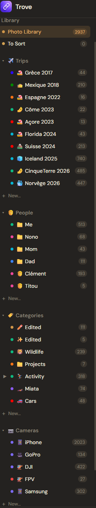
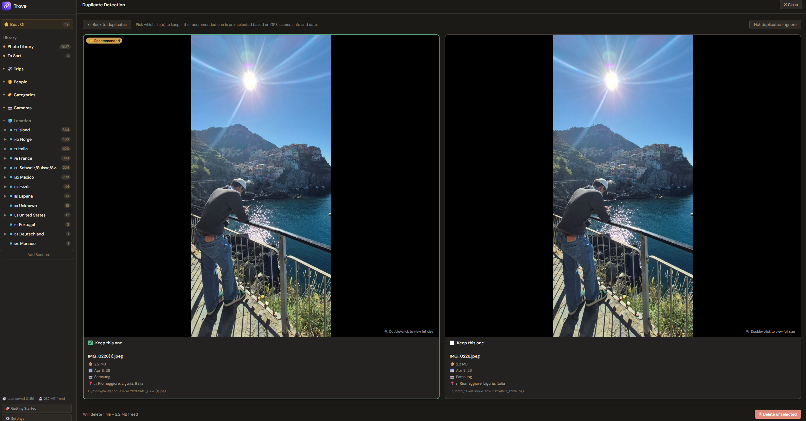
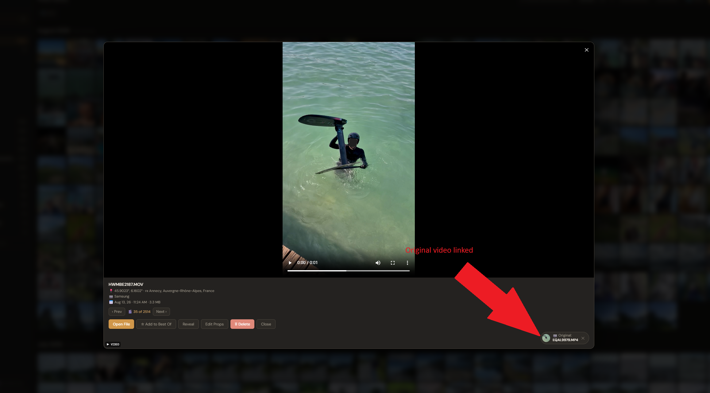
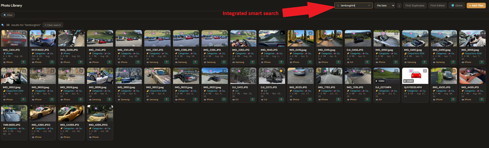
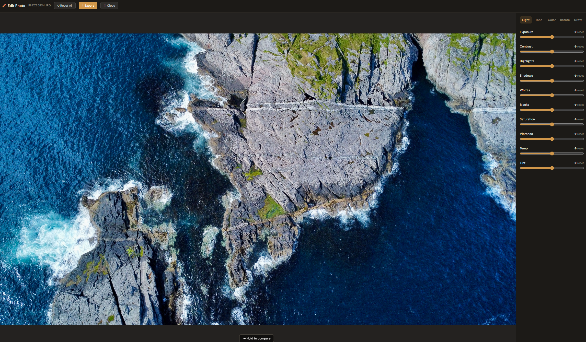

# Trove

Your photos and videos, finally organized. Not a single one of them ever leaves your computer.

Trove is a free, local-first photo organizer for Windows and macOS. It never uploads, copies, or moves your files: it just organizes links back to them, exactly where they already live on your drive. No cloud, no subscription, no account required. If you've been searching for how to sort a huge, messy photo library, the best way to store your photos, how to find duplicate photos, or how to find your old edited shots again, this page covers exactly what Trove does and how it works. Short answers to those questions are in the [FAQ](FAQ.md).

  
  &nbsp;
  

Windows (any recent PC) · macOS (Apple Silicon, M1/M2/M3/M4)

---

---

## Why a local, zero-copy photo organizer

Every other photo app wants to upload your library somewhere: a cloud, a subscription, someone else's servers. Trove doesn't. It's zero-copy, meaning it never duplicates or moves a single file. Every photo card you see in Trove is just a pointer back to the real file, sitting exactly where it already was, on any drive: internal, external SSD, or NAS. Nothing is sent anywhere, nothing changes unless you change it. You stay the only owner of your own memories.

## Organize your photo library automatically: trips, people, cameras, and location

Stop manually dragging thousands of files into folders. Trove reads what's already in your photos and organizes them for you:

- **Trips.** Photos and videos are grouped into trips automatically as you import them, ready to browse or relive on the 3D Globe.
- **People.** Tag someone once and Trove keeps every photo of them together in one folder. Tagging is manual: Trove has no facial recognition, so who's in your photos is never analyzed or sent anywhere.
- **Cameras.** Each photo's camera make and model is read from its metadata and sorted into its own folder automatically. Shooting with two of the exact same camera model? Camera Profiles teach Trove to tell them apart by filename pattern instead.
- **Location.** Country, region, and city are looked up from each photo's GPS data, so your library can be browsed by where you actually were.
- **Categories and custom sections.** Build your own sidebar sections, with your own name, icon, and color, for anything that doesn't fit trips or people.

## Never sort a photo library by hand again: Guided Sort

Wondering how to sort thousands of unsorted photos without losing a weekend to it? That's exactly what Guided Sort is for. It walks your "To Sort" backlog one cluster at a time (grouped by trip, date, person, camera, or location) and asks a single question per cluster instead of per photo. A first-run wizard walks brand-new libraries through the same idea from your very first import.

<!-- SCREENSHOT: Guided Sort or Getting Started wizard screen -->

## Find duplicate photos automatically

Click "Find Duplicates" and Trove scans your entire library for visual duplicates, not just identical files. It compares a structural fingerprint and color profile of every photo (and, for videos, duration) to catch near-identical shots even after a resize, a re-save, or a rename. Nothing is ever deleted automatically: every group is shown side by side for you to confirm, with the better copy pre-suggested by resolution and metadata.

## Find and compare edited photos

Ever edited a photo or video and ended up with two copies of the same shot, one edited and one untouched, with no way to remember which is which? That's exactly the problem "Find Edited" solves. It runs as a separate scan, tuned to catch original-and-edited pairs (a straight-out-of-camera shot next to your filtered or cropped version of it) rather than accidental duplicates. Confirmed pairs link together and open in a side-by-side compare view any time, so you can always find your way back to the original.

## Search your photos by what's actually in them, with on-device AI

Type what you remember, not what the file is named. Search "beach sunset" or "dog on a hike" and Trove finds it even if the filename is `IMG_4021.heic`, using an on-device AI model (CLIP) that understands what's actually in a photo, not just its metadata. It runs entirely on your computer: no photo, description, or query is ever sent anywhere. Results found by content instead of filename or tags carry a 🧠 badge, so you always know why a match showed up.

## Edit photos without leaving your library

Right-click any photo for a full, non-destructive editor: exposure, contrast, highlights, shadows, whites, and blacks under Light; RGB tone curves under Tone; saturation, vibrance, temperature, and 8-band HSL color adjustments under Color; rotate and straighten; and a freehand draw/annotate layer. Every edit is stored separately from your original file, which is never overwritten, and can be exported as a new copy whenever you want to share it.

## Relive your trips on a 3D globe

Every geotagged photo and video is plotted on a real-terrain 3D globe, zoomable all the way down to street level. "Relive Trip" opens on an overview of the entire trip first, then lets you step through it day by day.

  
  

## More, worth knowing about

- **Best Of.** A library-wide highlight reel, separate from per-folder pinning: star anything, anywhere, and it shows up in one place.
- **Live Photos & Burst review.** Live Photos play their motion clip in one click. Rapid-fire bursts collapse into a single card, so you pick a favorite instead of scrolling past ten near-identical shots.
- **Drag & drop.** Drop a folder in and Trove imports it as a new trip. Drop loose files in and they're added straight to your library.
- **Automatic backups.** Your library's organization (folders, tags, edits) is backed up automatically as you work, with automatic recovery if anything ever gets corrupted. Your original photo and video files are a separate matter: since Trove never copies or moves them in the first place, back those up the normal way, same as you would without Trove.

## How Trove compares to Google Photos, Apple Photos, and Lightroom

The short version: other apps want your library uploaded or imported into a catalog they control. Trove reads what's already on your drive and organizes it in place.

| | **Trove** | Google Photos | Apple Photos / iCloud | Adobe Lightroom |
|---|---|---|---|---|
| Cost | Free | Free tier, then paid storage | Free tier, then paid storage | Subscription |
| Cloud upload required | No | Yes | Yes (for sync) | Optional, but cloud sync is paid |
| Copies or moves your files | Never (zero-copy) | Yes, uploads a copy | Yes, imports into Photos library | Yes, imports into a catalog |
| Works on an existing messy folder structure | Yes, no re-import needed | No, requires upload | No, requires import | No, requires import |
| Automatic duplicate finder | Yes, visual matching | Limited | Limited | No, third-party plugins only |
| Links edited photos back to the original | Yes, automatic | No | Limited (Photos edits only) | Yes, within its own catalog |
| On-device AI content search | Yes, fully offline | Yes, but cloud-based | Yes, but limited | No |
| Account required | No | Yes | Yes | Yes |

## How Trove compares to digiKam and XnView MP

digiKam and XnView MP are the two free, local, non-cloud alternatives people usually land on for Windows. Both are capable, but both were built as photographer tools first: catalogs, IPTC/XMP metadata fields, RAW pipelines, and menus full of options aimed at someone who already knows what a catalog or a metadata field is. Trove is built for the opposite starting point: someone who just wants their photos organized, with nothing to configure and no manual tagging to do first.

| | **Trove** | digiKam | XnView MP |
|---|---|---|---|
| Built for | Anyone with a messy photo folder | Photographers managing large, tagged archives | Fast browsing and batch file operations |
| Setup before it's useful | None, open it and it organizes automatically | Album structure, tag hierarchy, metadata setup | Folder structure you build yourself |
| Organizes by trip and person automatically | Yes, no tagging required to start | Only after you manually tag and structure albums | No |
| Interface | Modern, guided, one screen at a time (Guided Sort) | Dense, professional, many panels and menus | Explorer-style file browser |
| Finds duplicate photos | Yes, visual matching, reviewed side by side | Yes, but manual setup | Yes |
| Links an edited photo back to its original automatically | Yes | No | No |
| RAW development, IPTC/XMP metadata editing | No, not the point of the app | Yes | Limited |
| Learning curve | Minutes | Hours to learn the workflow | Low to moderate |

If digiKam looks powerful but overwhelming, or XnView feels like a file browser rather than something that actually organizes your library, that gap is exactly what Trove is for.

## Frequently asked questions

**What is the best photo organizer for Windows?** One that works on your existing files without a cloud account. Trove reads your library and automatically sorts it into Trips, People, Cameras, and Location, on Windows 10, Windows 11, and macOS (Apple Silicon), without moving a single file.

**What's the best way to store and organize my photos?** Keep your original files exactly where they already are, and layer organization on top instead of importing everything into a new managed library. That's what Trove's zero-copy design does: it links to your files rather than duplicating or moving them.

**How do I sort thousands of unsorted photos?** Use Guided Sort (above): it clears a backlog one cluster at a time, by trip, date, person, camera, or location, instead of asking you to file photos away one by one.

**What's the best photo organizer with a preview window?** Trove opens any photo or video in a full-screen preview straight from the library grid, no separate viewer needed, and uses that same preview for comparing duplicates and edited/original pairs.

**Is there an easier alternative to digiKam or XnView MP?** Trove is built for people who just want their photos organized, not for building a tagged photographer's archive. There is no album structure or metadata schema to set up first: open it, and trips, people, cameras, and locations are already sorted.

The full list, including duplicate detection, cloud-free storage, and platform support, is in [FAQ.md](FAQ.md).

---

## Installing

**Windows:** run the downloaded `.exe`. Windows will show a blue "Windows protected your PC" screen. That's just because the installer isn't signed with a paid certificate yet, not a sign of a problem. Click **More info → Run anyway**, then follow the installer.

**macOS:** open the downloaded `.dmg` and drag Trove into Applications. On first launch, macOS will say it "cannot be opened because Apple cannot check it for malicious software." Right-click (or Control-click) the app → **Open** → confirm. You only need to do this once.

Trove checks for updates automatically after that. No need to come back here for future versions.

---

This repo only ever contains the built app. Trove's source code is closed. If you're looking for the app itself, the buttons above are all you need.

**Topics:** photo organizer, photo manager, photo library organizer, duplicate photo finder, photo sorting software, local photo storage, offline photo organizer, no-cloud photo app, photo organizer for Windows, photo organizer for Mac, photo preview app, photo viewer, photo backup organization, find edited photos, AI photo search. See also: [llms.txt](llms.txt), [FAQ.md](FAQ.md).
