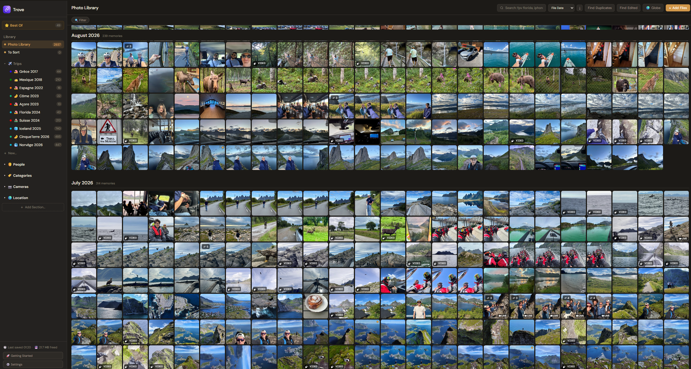
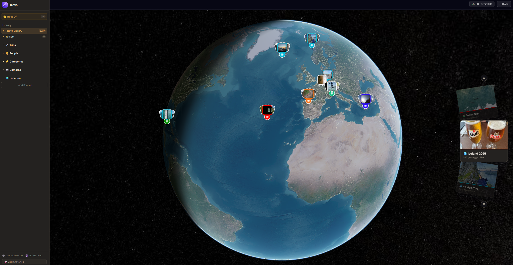
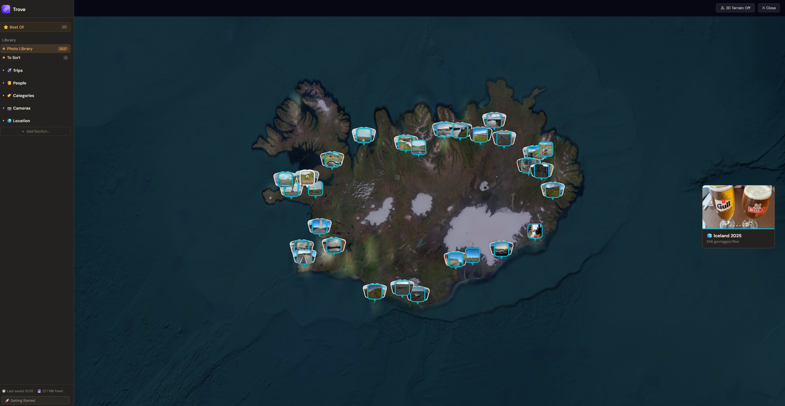

# Trove

Your photos and videos, finally organized. Not a single one of them ever leaves your computer.

Trove never uploads, copies, or moves your files. It just organizes links back to them: trips, people, a 3D globe of where they were taken, search by what's actually in a photo, and duplicate detection, all running locally on your machine.

  
  &nbsp;
  

Windows (any recent PC) · macOS (Apple Silicon, M1/M2/M3/M4)

---

---

## Why Trove

- **Your files never move.** Every photo you see is a link back to the real file, exactly where it already lives on your drive. Nothing is duplicated, nothing is uploaded.
- **Trips & people.** A guided setup sorts your library by trip and who's in it.
- **3D Globe.** See where your photos were taken, with routes between trips.
- **Search by what's *in* the photo.** Type "beach sunset" and find it, even if the filename is `IMG_4021.heic`. Matching runs entirely on your computer.
- **Duplicate & edited-photo detection.** Find visual duplicates and likely original/edited pairs across a big library.
- **Works with any drive:** internal, external SSD, NAS, anywhere.

**The 3D Globe:** every geotagged photo and video plotted on a real-terrain globe, zoomable down to street level.

  
  

---

## Installing

**Windows:** run the downloaded `.exe`. Windows will show a blue "Windows protected your PC" screen. That's just because the installer isn't signed with a paid certificate yet, not a sign of a problem. Click **More info → Run anyway**, then follow the installer.

**macOS:** open the downloaded `.dmg` and drag Trove into Applications. On first launch, macOS will say it "cannot be opened because Apple cannot check it for malicious software." Right-click (or Control-click) the app → **Open** → confirm. You only need to do this once.

Trove checks for updates automatically after that. No need to come back here for future versions.

---

This repo only ever contains the built app. Trove's source code is closed. If you're looking for the app itself, the buttons above are all you need.
