# Trove

Your photos and videos, finally organized. Not a single one of them ever leaves your computer.

Trove is a free, local-first photo organizer and editor for Windows and macOS. It never uploads, copies, or moves your files: it organizes links back to them, exactly where they already live on your drive. No cloud, no subscription, no account. Everything smart it does, from searching photos by what's in them to recognizing the people in them, runs on your own computer.

If you've been searching for how to sort a huge, messy photo library, how to find duplicate photos, how to find your old edited shots again, or how to remove an object from a photo without uploading it anywhere, this page covers what Trove does and how. Short answers are in the [FAQ](FAQ.md).

  
  &nbsp;
  

Windows (any recent PC) · macOS (Apple Silicon, M1/M2/M3/M4)

---

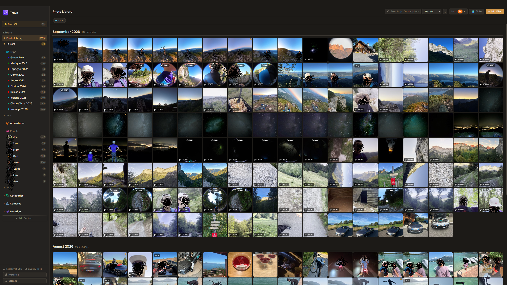

---

## Why a local, zero-copy photo organizer

Most photo apps want your library uploaded somewhere, or imported into a catalog they control. Trove doesn't. It's zero-copy: it never duplicates or moves a single file. Every card you see is a pointer to the real file, sitting where it already was, on any drive: internal, external SSD, or NAS. Nothing is sent anywhere, and nothing changes unless you change it.

## Your library, organized for you

Stop dragging thousands of files into folders. Trove reads what's already in your photos and sorts them:

- **Trips.** Photos and videos are grouped into trips as you import them, ready to browse or relive on the 3D globe.
- **People.** Everyone gets a folder, shown with a real photo of their face: their Best Of shot if there is one, otherwise a pinned photo, otherwise their best smiling, front-facing shot.
- **Cameras.** Each photo's camera is read from its metadata and sorted into its own folder. Two of the exact same camera? Camera Profiles tell them apart by filename pattern.
- **Location.** Country, region, and city come from each photo's GPS data.
- **Categories and custom sections.** Your own sidebar sections, with your own name, icon, and color.

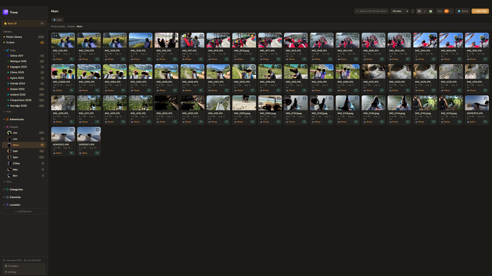

## One Sort button for all the cleanup

Everything that tidies your library lives behind the **Sort** button at the top: Guided Sort, Find new people, Find Duplicates, and Find Edited. An orange badge shows how much is waiting in each (up to 9+), so you can see at a glance where there's cleanup left to do.

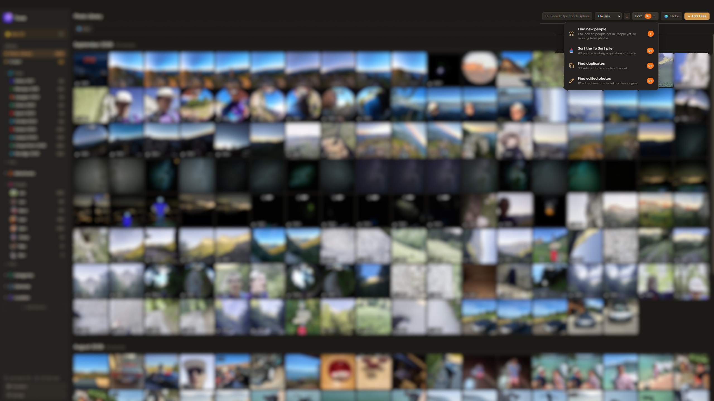

## Face recognition that never leaves your computer

Face recognition is optional and off until you turn it on. When it's on, faces are found and compared entirely on your computer, with a model that ships inside the app. No photo, face, or name is uploaded, and turning it off deletes every bit of face data Trove stored.

It learns from what you've already done. If you have a People folder for someone, Trove works out which face in those photos is theirs and uses it to find them everywhere else, so the only faces it asks about are the ones it doesn't recognize yet. In a group photo where four of five people are already known, it knows the fifth is someone new and suggests adding them.

**Find new people** scans the whole library. While it works, the screen fills up with every face it has found so far, new ones popping in as they're discovered, with a progress bar and the time left. The scan keeps going at full speed when you switch to another app, so you don't have to watch it.

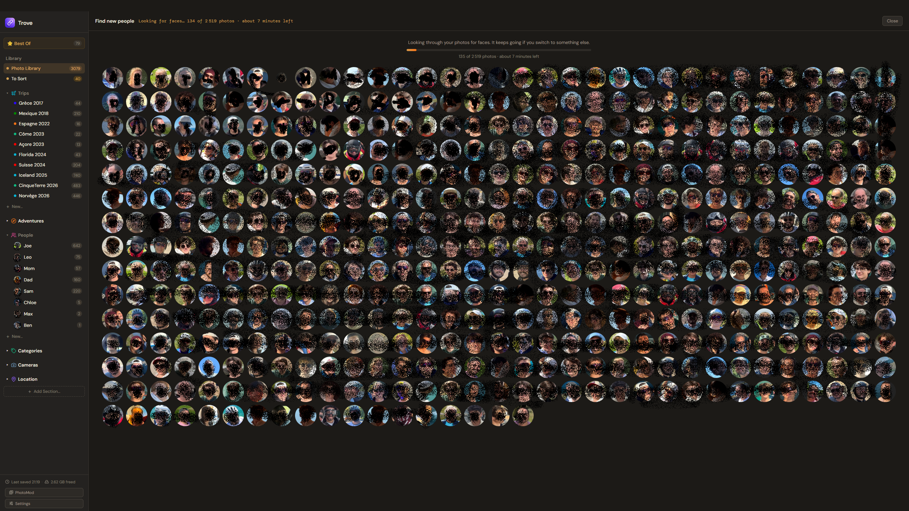

Once it's done, you see everyone it recognized, grouped by person, and you check the suggestions with one click per face (or confirm a whole person at once):

  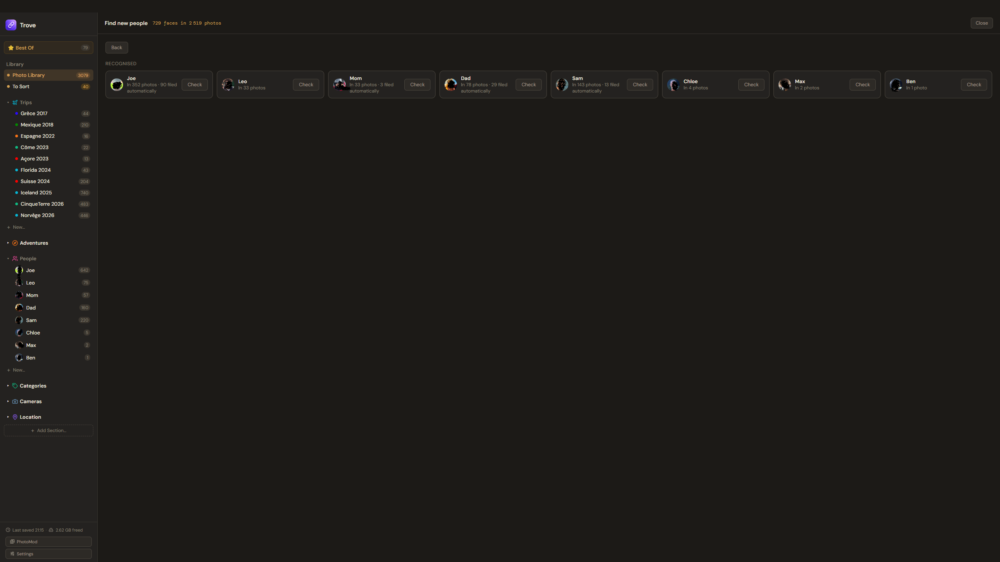
  

## See where every photo belongs

Open any photo or video and small bubbles along the bottom show every folder it's in: the trip, the people, the camera. Each person's bubble uses their face from that exact photo, and one click takes you to that folder.

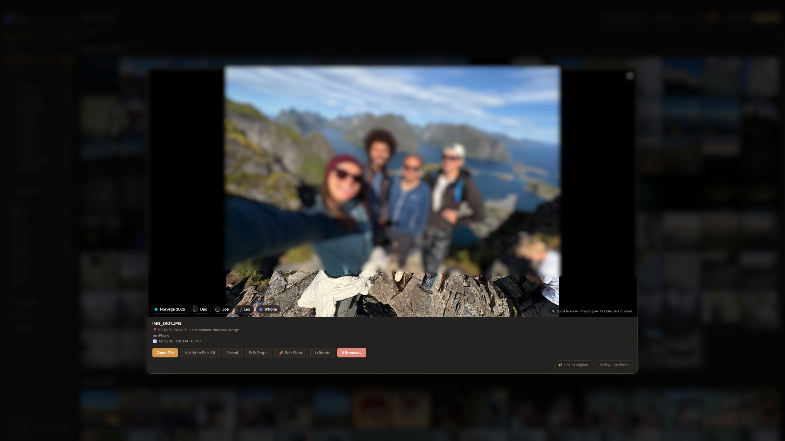

## Works with almost every photo and video format

Point Trove at a folder and nothing gets left behind. It recognizes around 70 formats, including the ones most organizers skip:

- **Photos:** JPEG, PNG, HEIC and HEIF (iPhone), AVIF, WebP, GIF, TIFF, BMP.
- **RAW files** from Canon (CR2, CR3), Nikon (NEF), Sony (ARW), Fujifilm (RAF), Olympus and OM System (ORF), Panasonic (RW2), Pentax (PEF), Samsung (SRW), Leica, Hasselblad, Phase One, Sigma, GoPro, and any DNG. Trove shows them, reads their camera and date, and opens them in the editor. It doesn't develop RAW files: that's what Lightroom or darktable are for.
- **Videos:** MP4, MOV, MKV, WebM, AVI, WMV, MPG, MTS and M2TS (camcorders), 3GP, FLV, MXF, and more.
- **360 cameras:** Insta360 photos and videos (INSP, INSV), plus GoPro MAX files.

RAW files show the full-size preview the camera saved inside them, and web formats like WebP, AVIF, and GIF are decoded by Trove itself. Videos the built-in player can't handle (older AVI, WMV, or MPG files, for example) still get a thumbnail and open in your default video player with one click.

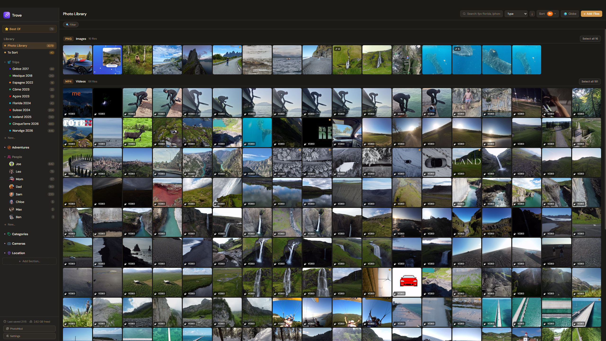

## Search your photos by what's in them

Type what you remember, not what the file is called. Search "mountain lake" or "dog on a hike" and Trove finds it even if the file is named `IMG_4021.heic`, using an on-device AI model (CLIP) that understands what's in a photo. It runs entirely on your computer: no photo or search is ever sent anywhere. Results found by content carry a 🧠 badge, so you know why they showed up.

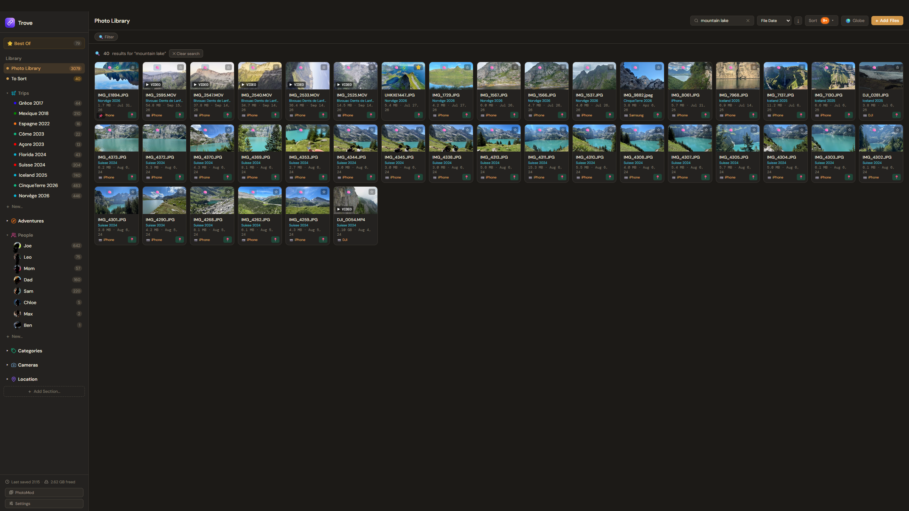

## Guided Sort: clear a backlog without sorting photo by photo

Thousands of unsorted photos? Guided Sort walks your "To Sort" pile one cluster at a time (grouped by trip, date, person, camera, or location) and asks one question per cluster instead of one per photo.

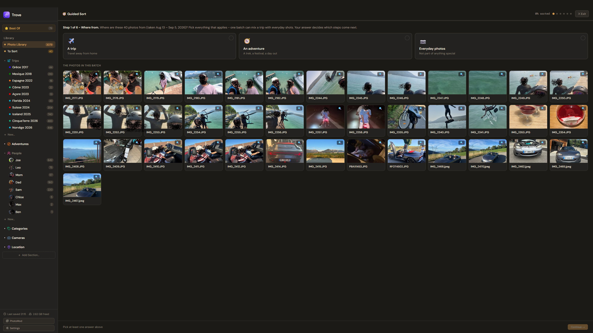

## Find duplicate photos

Find Duplicates scans your whole library for visual duplicates, not just identical files. It compares a structural fingerprint and color profile of every photo (and duration, for videos), so it catches near-identical shots even after a resize, a re-save, or a rename. Nothing is deleted automatically: each group is shown side by side, with the better copy pre-selected based on GPS, camera info, and date.

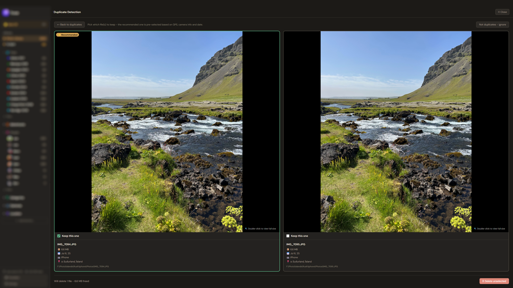

## Find edited photos and link them to their originals

Edited a photo and ended up with two copies, one edited and one untouched? Find Edited pairs them up. Pairs Trove is certain about, like iPhone edits (`IMG_E1234` next to `IMG_1234`) or DJI app exports next to the drone's original, go into a batch at the top that you can confirm with one button. Everything else is only suggested when the visual match is at least 98%, for you to check one by one.

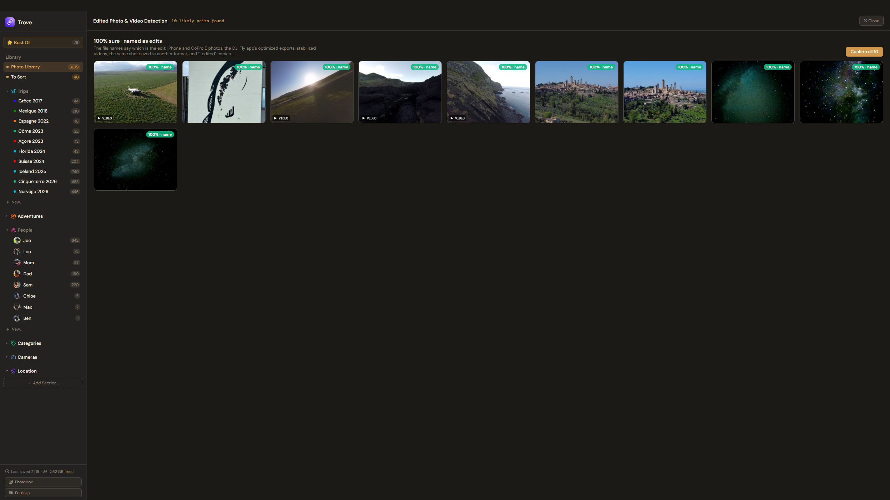

Linked pairs stay connected. An edited photo shows an "Original" badge, and the compare view puts both side by side, with a delete button under each, so you can drop the one you don't need right there.

  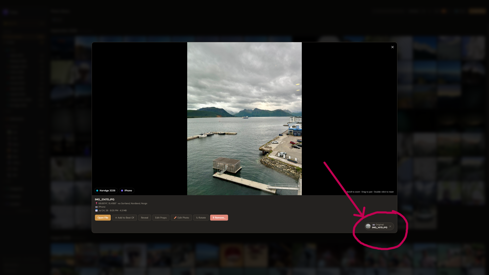
  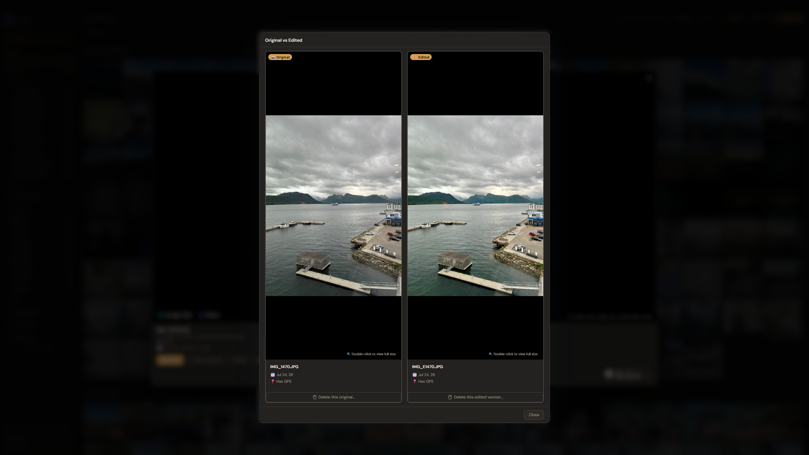

## Quick edits from your library

Right-click any photo and choose Edit Photo for fast, non-destructive adjustments:

- **Colors:** exposure, contrast, highlights, shadows, whites and blacks, RGB tone curves, saturation, vibrance, temperature, and 8-band HSL.
- **Direction:** rotate and straighten.
- **Brush:** draw or annotate.
- **Masks:** paint where an adjustment applies, to brighten a face or darken a sky without touching the rest.

Your original file is never overwritten. Edits are kept separately and can be exported as a new copy whenever you want.

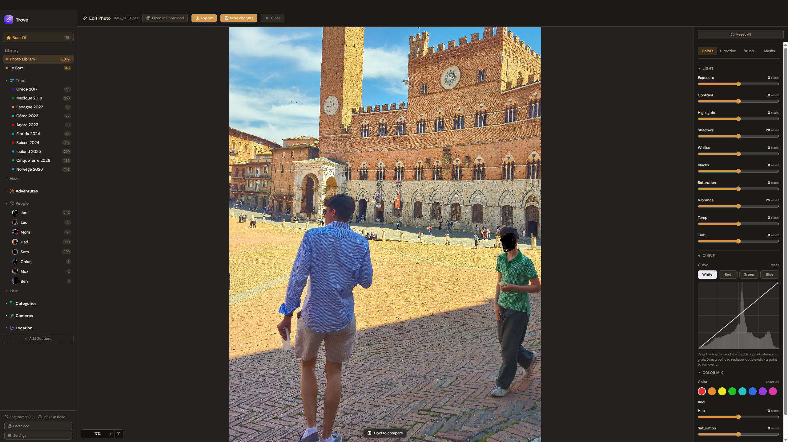

## PhotoMod: a full photo editor, built in

For anything beyond a quick fix, open PhotoMod from the bottom of the sidebar. It's a layer-based editor in the spirit of Photoshop, working on your own files, with nothing uploaded:

- **Layers.** Place other photos, add text (straight or on a curve), and use opacity, blend modes, and clipping masks.
- **Transform and warp:** scale, rotate, distort, skew, perspective, and mesh warp.
- **Selections:** rectangle, ellipse, polygon lasso, and Auto select, then cut, copy, fill, erase, or remove.
- **Adjustments** for the whole picture or a single layer, plus canvas size, image size, brush, highlighter, paint bucket, and eyedropper.

Start from a photo in your library or a blank canvas. PhotoMod never saves on its own: when you press Save, the result is added to your library as a new version, linked to the original and saved at the same quality as the original photo.

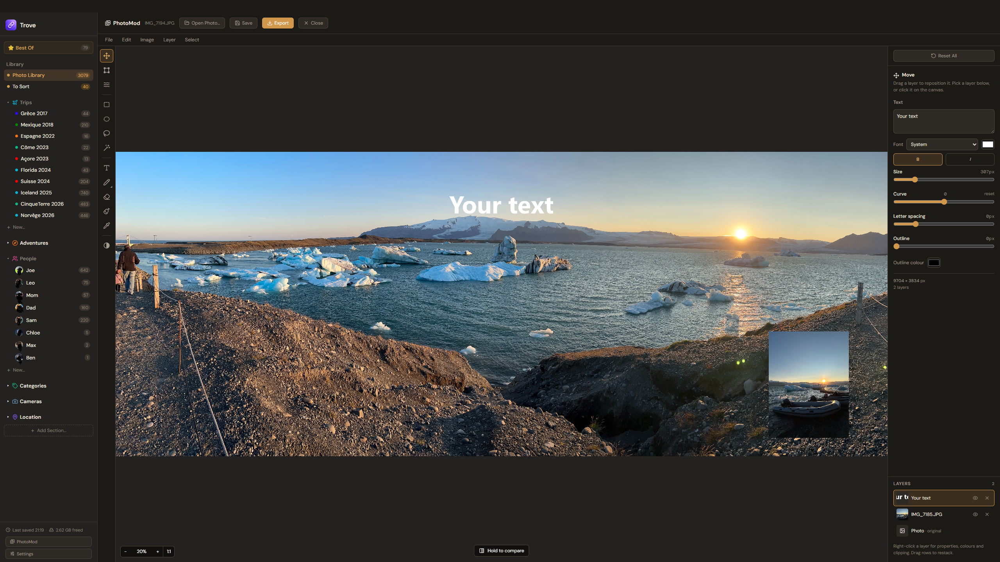

### Smart eraser

Paint over something you want gone (a stranger in the background, a sign, a bin) and let go. It's filled in with real texture copied from around it, so water keeps rippling and sand stays sand. The fill goes on its own layer, so the original is never touched.

  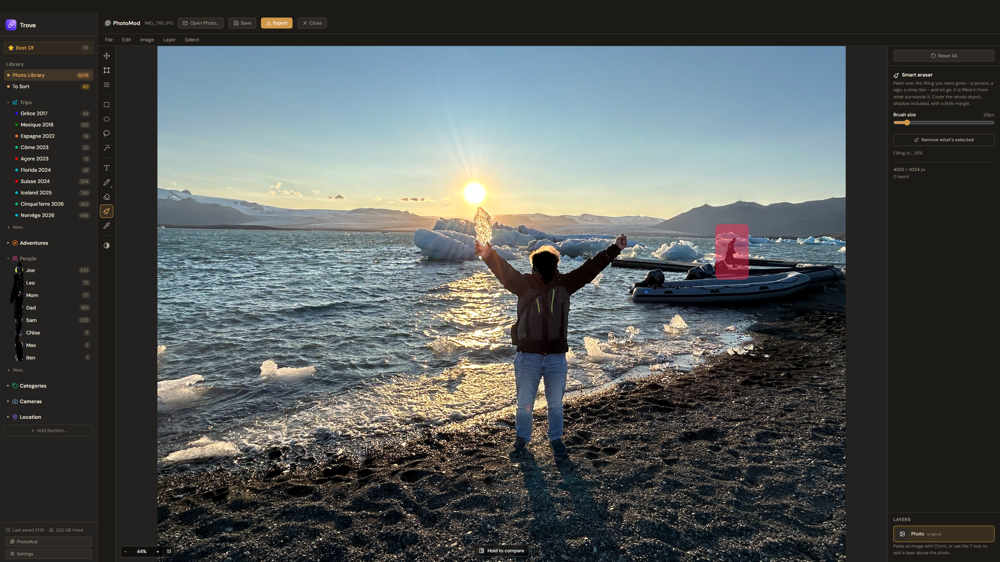
  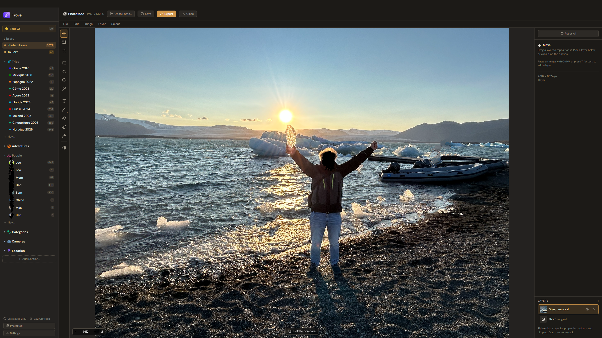

### Auto select

Click an object and it's selected, outline and all. An on-device AI model recognizes whole objects, however many colors they have. A Color mode selects similar colors instead, like a magic wand. Shift+click adds, Alt+click takes away.

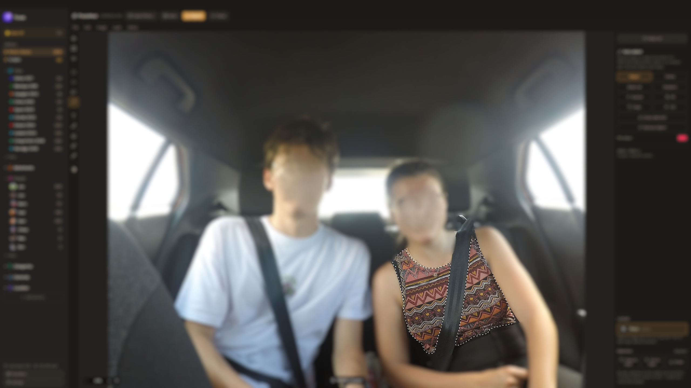

## 360 photos and videos

Insta360 photos and videos open in an interactive 360 viewer: drag to look around, scroll to zoom. Videos recorded with the camera's gyro data get an angle lock that keeps the horizon level and the shake out. Any view can be saved as a regular photo.

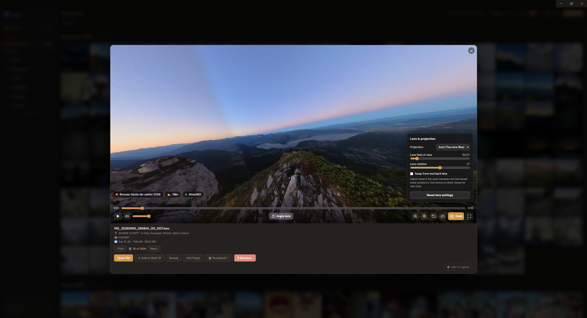

## Relive your trips on a 3D globe

Every geotagged photo and video is plotted on a real-terrain 3D globe, zoomable down to street level. "Relive Trip" opens on an overview of the whole trip, then steps through it day by day.

  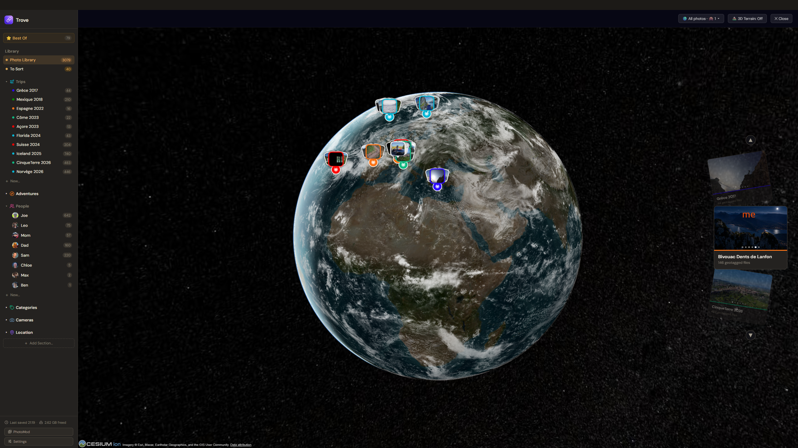
  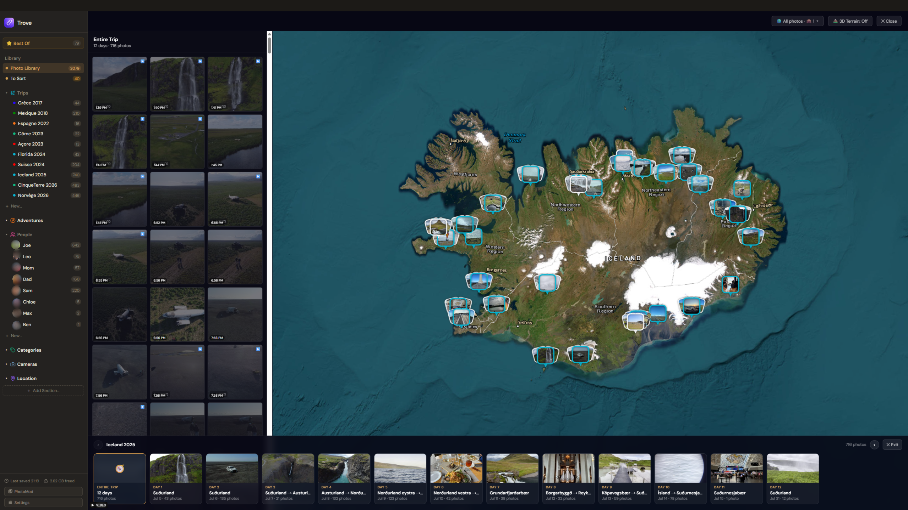

## More worth knowing

- **Best Of.** A library-wide highlight reel: star anything, anywhere, and it shows up in one place.
- **Live Photos and bursts.** Live Photos play their motion clip in one click. Bursts collapse into a single card, so you pick a favorite instead of scrolling past ten near-identical shots.
- **Video frame grabs.** Pause any video and save the frame as a full-resolution photo, with the video's date, camera, and GPS location written into it. Any frame can also become the video's thumbnail.
- **Safe deleting.** Removing something always asks one clear question: take it out of Trove (the file stays on your drive) or delete the file itself (to the Recycle Bin by default). Deleting from disk can be switched off entirely, and Trove keeps a running total of the space you've freed.
- **Drag and drop.** Drop a folder in and it becomes a new trip. Drop loose files in and they join your library.
- **Automatic backups.** Your library's organization (folders, tags, edits, people) is backed up as you work, with automatic recovery if anything gets corrupted. Your photo and video files themselves are yours to back up the usual way: Trove never copies or moves them in the first place.

## How Trove compares to Google Photos, Apple Photos, and Lightroom

The short version: other apps want your library uploaded, or imported into a catalog they control. Trove reads what's already on your drive and organizes it in place.

| | **Trove** | Google Photos | Apple Photos / iCloud | Adobe Lightroom |
|---|---|---|---|---|
| Cost | Free | Free tier, then paid storage | Free tier, then paid storage | Subscription |
| Cloud upload required | No | Yes | Yes (for sync) | Optional, but cloud sync is paid |
| Copies or moves your files | Never (zero-copy) | Yes, uploads a copy | Yes, imports into the Photos library | Yes, imports into a catalog |
| Works on an existing messy folder structure | Yes, no re-import | No, requires upload | No, requires import | No, requires import |
| Face recognition | Yes, on your computer, opt-in | Yes, in the cloud | Yes, on device | Yes |
| Learns people from folders you already have | Yes | No | No | No |
| Automatic duplicate finder | Yes, visual matching | Limited | Yes | No, third-party plugins only |
| Links edited photos back to the original | Yes, automatic | No | Limited (Photos edits only) | Yes, within its own catalog |
| On-device AI content search | Yes, fully offline | Yes, but in the cloud | Yes | Yes, but cloud-based |
| Layer editor with object removal | Yes, built in, offline | Object removal only, no layers | Object removal only, no layers | Object removal; layers need Photoshop |
| Account required | No | Yes | Yes | Yes |

## How Trove compares to digiKam and XnView MP

digiKam and XnView MP are the free, local alternatives people usually find for Windows. Both are capable, but both were built as photographer tools first: catalogs, IPTC/XMP fields, RAW pipelines, and menus aimed at someone who already knows what those are. Trove starts from the other end: someone who wants their photos organized, with nothing to configure first.

| | **Trove** | digiKam | XnView MP |
|---|---|---|---|
| Built for | Anyone with a messy photo folder | Photographers managing large, tagged archives | Fast browsing and batch file operations |
| Setup before it's useful | None, it organizes on its own | Album structure, tag hierarchy, metadata setup | A folder structure you build yourself |
| Organizes by trip and person automatically | Yes | Only after you tag and structure albums | No |
| Face recognition | Yes, learns from your People folders | Yes, trained by tagging faces | No |
| Interface | Modern and guided, one step at a time | Dense and professional, many panels | Explorer-style file browser |
| Finds duplicate photos | Yes, reviewed side by side | Yes, with manual setup | Yes |
| Links an edited photo back to its original automatically | Yes | No | No |
| Shows RAW files | Yes | Yes | Yes |
| RAW development, IPTC/XMP editing | No, not the point of the app | Yes | Limited |
| Learning curve | Minutes | Hours | Low to moderate |

If digiKam looks powerful but overwhelming, or XnView feels like a file browser rather than something that organizes your library, that gap is what Trove is for.

## Frequently asked questions

**What is the best photo organizer for Windows?** One that works on your existing files without a cloud account. Trove sorts your library into Trips, People, Cameras, and Location on Windows 10, Windows 11, and macOS (Apple Silicon), without moving a single file.

**What's the best way to store and organize my photos?** Keep your original files where they already are, and layer organization on top instead of importing everything into a new managed library. That's Trove's zero-copy design: it links to your files rather than duplicating or moving them.

**Does Trove have face recognition? Is it private?** Yes, and it's opt-in. Faces are found and compared entirely on your computer, nothing is uploaded, and turning it off deletes all the face data. It learns from the People folders you already have, so it only asks about faces it doesn't know.

**How do I sort thousands of unsorted photos?** Use Guided Sort: it clears a backlog one cluster at a time, by trip, date, person, camera, or location, instead of one photo at a time.

**Does Trove open RAW and HEIC files?** Yes. RAW files from every major camera brand plus any DNG, and iPhone HEIC photos, alongside JPEG, PNG, and the rest, around 70 formats in total. On Windows, HEIC photos use Windows' own HEIC support (Microsoft's HEIF and HEVC extensions, from the Microsoft Store), which many PCs already have.

**How do I find edited copies of my photos?** Run Find Edited from the Sort menu. iPhone and DJI edits are paired with their originals automatically and confirmed with one button; other pairs are suggested only when they're a near-certain visual match.

**How do I remove a person or object from a photo without uploading it?** Open the photo in PhotoMod, pick the Smart eraser, and paint over what you want gone. It's filled in from its surroundings, on your computer, on its own layer, so your original is never touched.

**Is there an easier alternative to digiKam or XnView MP?** Trove is built for people who want their photos organized, not for building a tagged archive. There's no album structure or metadata schema to set up: open it, and trips, people, cameras, and locations are already sorted.

The full list, including duplicate detection, cloud-free storage, and platform support, is in [FAQ.md](FAQ.md).

---

## Installing

**Windows:** run the downloaded `.exe`. Windows will show a blue "Windows protected your PC" screen. That's only because the installer isn't signed with a paid certificate yet, not a sign of a problem. Click **More info → Run anyway**, then follow the installer.

**macOS:** open the downloaded `.dmg` and drag Trove into Applications. On first launch, macOS will say it "cannot be opened because Apple cannot check it for malicious software." Right-click (or Control-click) the app → **Open** → confirm. You only need to do this once.

Trove checks for updates automatically after that. No need to come back here for new versions.

---

This repo only contains the built app. Trove's source code is closed. If you're looking for the app itself, the buttons above are all you need.

[Privacy policy](PRIVACY.md) · [Terms of use](TERMS.md)

**Topics:** photo organizer, photo manager, photo library organizer, duplicate photo finder, photo sorting software, local photo storage, offline photo organizer, no-cloud photo app, private face recognition, on-device face recognition, photo organizer for Windows, photo organizer for Mac, photo viewer, RAW photo viewer, HEIC viewer for Windows, photo editor with layers, remove objects from photos, 360 photo viewer, find edited photos, AI photo search. See also: [llms.txt](llms.txt), [FAQ.md](FAQ.md).
